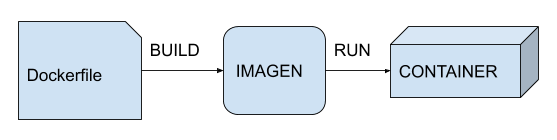

## [ IMAGENES ](https://github.com/markdown-it/markdown-it-emoji)

Una imagen es una especie de plantilla, una captura del estado de un contenedor.

Las imágenes se identifican por un ID, y un par nombre-versión, por ejemplo: ubuntu:latest, django:1.6, etc.

```cmd
$ docker pull redis

Using default tag: latest
latest: Pulling from library/redis
bf5952930446: Pulling fs layer
911b8422b695: Pulling fs layer
093b947e0ade: Pulling fs layer
5b1d5f59e382: Pulling fs layer
7a5f59580c0b: Pulling fs layer
f9c63997c980: Pulling fs layer
5b1d5f59e382: Waiting
7a5f59580c0b: Waiting
f9c63997c980: Waiting
911b8422b695: Verifying Checksum
911b8422b695: Download complete
093b947e0ade: Verifying Checksum
093b947e0ade: Download complete
7a5f59580c0b: Verifying Checksum
7a5f59580c0b: Download complete
f9c63997c980: Verifying Checksum
f9c63997c980: Download complete
5b1d5f59e382: Verifying Checksum
5b1d5f59e382: Download complete
bf5952930446: Verifying Checksum
bf5952930446: Download complete
bf5952930446: Pull complete
911b8422b695: Pull complete
093b947e0ade: Pull complete
5b1d5f59e382: Pull complete
7a5f59580c0b: Pull complete
f9c63997c980: Pull complete
Digest: sha256:09c33840ec47815dc0351f1eca3befe741d7105b3e95bc8fdb9a7e4985b9e1e5
Status: Downloaded newer image for redis:latest
docker.io/library/redis:latest

$ docker image ls

REPOSITORY                   TAG                 IMAGE ID            CREATED             SIZE
redis                        latest              1319b1eaa0b7        3 days ago          104MB
fauria/vsftpd                latest              2497f179cf1d        9 months ago        391MB
c4rlosc7/cheers2019          latest              15b1e83a4f6f        12 months ago       4.01MB
```

Docker hub: [DockerHub](https://hub.docker.com/)

Your username is: c4rlosc7

## [ Create a Dockerfile ](https://github.com/markdown-it/markdown-it-emoji)

```docker
> touch Dockerfile

> nano 
--------------------------------------------
FROM ubuntu

RUN touch /usr/src/hola-carlos
--------------------------------------------

# docker build -t ubuntu:carlos .
```

```cmd
$ docker build -t ubuntu:carlos .
Sending build context to Docker daemon   42.5kB
Step 1/2 : FROM ubuntu
 ---> 3556258649b2
Step 2/2 : RUN touch /usr/src/hola-carlos
 ---> Running in 467c4942c509
Removing intermediate container 467c4942c509
 ---> 5fbbea707e44
Successfully built 5fbbea707e44
Successfully tagged ubuntu:carlos
SECURITY WARNING: You are building a Docker image from Windows against a non-Windows Docker host. All files and directories added to build context will have '-rwxr-xr-x' permissions. It is recommended to double check and reset permissions for sensitive files and directories.

```



## [ Execute image created ](https://github.com/markdown-it/markdown-it-emoji)

```docker
 $ docker run -it ubuntu:carlos
the input device is not a TTY.  If you are using mintty, try prefixing the command with 'winpty'

$ winpty docker run -it ubuntu:carlos

```

## [ push at docker hub ](https://github.com/markdown-it/markdown-it-emoji)

```docker
$ docker push ubuntu:carlos
The push refers to repository [docker.io/library/ubuntu]
4877e3395052: Preparing
b079b3fa8d1b: Preparing
a31dbd3063d7: Preparing
c56e09e1bd18: Preparing
543791078bdb: Preparing
denied: requested access to the resource is denied

$ docker push c4rlosc7/ubuntu:carlos
The push refers to repository [docker.io/c4rlosc7/ubuntu]
4877e3395052: Preparing
b079b3fa8d1b: Preparing
a31dbd3063d7: Preparing
c56e09e1bd18: Preparing
543791078bdb: Preparing
a31dbd3063d7: Mounted from library/ubuntu
c56e09e1bd18: Mounted from library/ubuntu
543791078bdb: Mounted from library/ubuntu
b079b3fa8d1b: Mounted from library/ubuntu
4877e3395052: Pushed
carlos: digest: sha256:03acbb1795106d92299747fad2f174ac766ebf1c6b4efdcb04fa699aac9e57d3 size: 1359
```

## [ how is it built an image ](https://github.com/markdown-it/markdown-it-emoji)

```docker
$ docker history ubuntu:carlos
IMAGE               CREATED             CREATED BY                                      SIZE                COMMENT
5fbbea707e44        11 hours ago        /bin/sh -c touch /usr/src/hola-carlos           0B
3556258649b2        12 months ago       /bin/sh -c #(nop)  CMD ["/bin/bash"]            0B
<missing>           12 months ago       /bin/sh -c mkdir -p /run/systemd && echo 'do…   7B
<missing>           12 months ago       /bin/sh -c set -xe   && echo '#!/bin/sh' > /…   745B
<missing>           12 months ago       /bin/sh -c [ -z "$(apt-get indextargets)" ]     987kB
<missing>           12 months ago       /bin/sh -c #(nop) ADD file:3ddd02d976792b6c6…   63.2MB
```

## [ run project example nodejs ](https://github.com/markdown-it/markdown-it-emoji)

```docker
$ docker build -t carlosapp .
Sending build context to Docker daemon  116.7kB
Step 1/6 : FROM node:8
8: Pulling from library/node
146bd6a88618: Pulling fs layer
9935d0c62ace: Pulling fs layer
db0efb86e806: Pulling fs layer
e705a4c4fd31: Pulling fs layer
c877b722db6f: Pulling fs layer
645c20ec8214: Pulling fs layer
db8fbd9db2fe: Pulling fs layer
1c151cd1b3ea: Pulling fs layer
fbd993995f40: Pulling fs layer
645c20ec8214: Waiting
db8fbd9db2fe: Waiting
1c151cd1b3ea: Waiting
e705a4c4fd31: Waiting
c877b722db6f: Waiting
fbd993995f40: Waiting
db0efb86e806: Verifying Checksum
db0efb86e806: Download complete
9935d0c62ace: Verifying Checksum
9935d0c62ace: Download complete
146bd6a88618: Verifying Checksum
146bd6a88618: Download complete
645c20ec8214: Verifying Checksum
645c20ec8214: Download complete
146bd6a88618: Pull complete
9935d0c62ace: Pull complete
db0efb86e806: Pull complete
db8fbd9db2fe: Verifying Checksum
db8fbd9db2fe: Download complete
1c151cd1b3ea: Verifying Checksum
1c151cd1b3ea: Download complete
fbd993995f40: Verifying Checksum
fbd993995f40: Download complete
e705a4c4fd31: Verifying Checksum

$ docker image ls
REPOSITORY                   TAG                 IMAGE ID            CREATED             SIZE
carlosapp                    latest              8fa173e3a6a2        6 minutes ago       915MB
ubuntu                       carlos              5fbbea707e44        12 hours ago        64.2MB

$ pwd
/c/Users/carlmacd/Desktop/wiki/DockerFundamentals/docker


$ docker run --rm -p 3000:3000 carlosapp

$ docker run --rm -p 3000:3000 -v /c/Users/carlmacd/Desktop/wiki/DockerFundamentals/docker:/usr/src carlosapp
```

