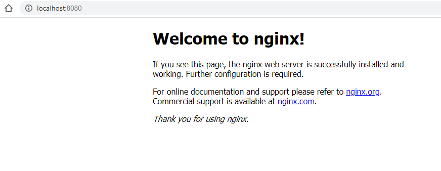

<h2 style="color:#0652DD;">What is docker ? 🙂</h2>

**Docker** is a set of platform as a service **(PaaS)** products that use OS-level virtualization to deliver software in packages called containers. Containers are isolated from one another and bundle their own software, libraries and configuration files.

<h2 style="color:#0652DD;">What is a container?</h2>

A container is a standard unit of software that packages up code and all its dependencies so the application runs quickly and reliably from one computing environment to another. A Docker container image is a lightweight, standalone, executable package of software that includes everything needed to run an application: code, runtime, system tools, system libraries and settings.

<h2 style="color:#0652DD;">What does docker solve?</h2>

- Missing or incorrect application dependencies such as libraries, interpreters, code/binaries, users.
- Conflicts between programs running on the same computer such as library dependencies or ports.
- Compatibility of each service with the libraries and dependencies of OS.
- Build and ship any application anywhere.

<h2 style="color:#0652DD;">BUILD, SHIP AND RUN YOUR CODE ANYWHERE</h2>

<h2 style="color:#0652DD;">docker is written in go</h2>

<br>

## [Docker hello world](https://github.com/markdown-it/markdown-it-emoji)

```cmd
> docker run hello-world

Hello from Docker!
This message shows that your installation appears to be working correctly.

To generate this message, Docker took the following steps:
 1. The Docker client contacted the Docker daemon.
 2. The Docker daemon pulled the "hello-world" image from the Docker Hub.
    (amd64)
 3. The Docker daemon created a new container from that image which runs the
    executable that produces the output you are currently reading.
 4. The Docker daemon streamed that output to the Docker client, which sent it
    to your terminal.

To try something more ambitious, you can run an Ubuntu container with:
 $ docker run -it ubuntu bash

Share images, automate workflows, and more with a free Docker ID:
 https://hub.docker.com/

For more examples and ideas, visit:
 https://docs.docker.com/get-started/
```

## [Show all containers](https://github.com/markdown-it/markdown-it-emoji)

```cmd
 >docker ps -a
 CONTAINER ID  IMAGE        COMMAND   CREATED         STATUS                     PORTS   NAMES
 70defa31416c  hello-world  "/hello"  12 minutes ago  Exited (0) 12 minutes ago          clever_noyce
```

## [Inspect containers metadata](https://github.com/markdown-it/markdown-it-emoji)

```cmd
 > docker inspect 70defa31416c
 CONTAINER ID  IMAGE        COMMAND   CREATED         STATUS                     PORTS   NAMES
 70defa31416c  hello-world  "/hello"  12 minutes ago  Exited (0) 12 minutes ago          clever_noyce

 > docker inspect -f '{{ json .Config.Env }}' clever_noyce
```

## [Docker rename](https://github.com/markdown-it/markdown-it-emoji)

```cmd
 > docker rename clever_noyce my-first-container

 > docker ps -a
 CONTAINER ID  IMAGE        COMMAND   CREATED         STATUS                     PORTS   NAMES
 70defa31416c  hello-world  "/hello"  12 minutes ago  Exited (0) 12 minutes ago          my-first-container
```

## [Docker delete](https://github.com/markdown-it/markdown-it-emoji)

```cmd
 > docker rm my-first-container

 > docker ps -a
 CONTAINER ID  IMAGE        COMMAND   CREATED         STATUS                     PORTS   NAMES
```

## [Show only IDs containers](https://github.com/markdown-it/markdown-it-emoji)

```cmd
 > docker ps -aq
70defa31416c
```

## [Delete all containers with IDs](https://github.com/markdown-it/markdown-it-emoji)

```cmd
 > docker rm $(docker ps -aq)
```

## [Docker Ubuntu](https://github.com/markdown-it/markdown-it-emoji)

```cmd
 > docker run ubuntu

 > docker ps -a 

 > CONTAINER ID        6a67ef654ae4
 IMAGE        ubuntu
 COMMAND        "/bin/bash"
 CREATED        About a minute ago   Exited (0)
 STATUS        About a minute
 PORTS        ago
 NAMES        sleepy_ptolemy

//  Modo interactivo con Ubuntu
 > docker run -it ubuntu
 root@ffa85e2fe8a8:/# ls -lac

total 72
drwxr-xr-x   1 root root 4096 Aug  9 03:03 .
drwxr-xr-x   1 root root 4096 Aug  9 03:03 ..
-rwxr-xr-x   1 root root    0 Aug  9 03:03 .dockerenv
drwxr-xr-x   2 root root 4096 Aug  2  2019 bin
drwxr-xr-x   2 root root 4096 Aug  2  2019 boot
drwxr-xr-x   5 root root  360 Aug  9 03:03 dev
drwxr-xr-x   1 root root 4096 Aug  9 03:03 etc
drwxr-xr-x   2 root root 4096 Aug  2  2019 home
drwxr-xr-x   8 root root 4096 Aug  2  2019 lib
drwxr-xr-x   2 root root 4096 Aug  2  2019 lib64
drwxr-xr-x   2 root root 4096 Aug  2  2019 media
drwxr-xr-x   2 root root 4096 Aug  2  2019 mnt
drwxr-xr-x   2 root root 4096 Aug  2  2019 opt
dr-xr-xr-x 140 root root    0 Aug  9 03:03 proc
drwx------   2 root root 4096 Aug  2  2019 root
drwxr-xr-x   1 root root 4096 Aug  2  2019 run
drwxr-xr-x   1 root root 4096 Aug  2  2019 sbin
drwxr-xr-x   2 root root 4096 Aug  2  2019 srv
dr-xr-xr-x  13 root root    0 Aug  9 03:05 sys
drwxrwxrwt   2 root root 4096 Aug  2  2019 tmp
drwxr-xr-x   1 root root 4096 Aug  2  2019 usr
drwxr-xr-x   1 root root 4096 Aug  2  2019 var

// OS
root@ffa85e2fe8a8:/# uname -a
Linux ffa85e2fe8a8 4.9.184-linuxkit #1 SMP Tue Jul 2 22:58:16 UTC 2019 x86_64 x86_64 x86_64 GNU/Linux

root@ffa85e2fe8a8:/# cat /etc/lsb-release
DISTRIB_ID=Ubuntu
DISTRIB_RELEASE=18.04
DISTRIB_CODENAME=bionic
DISTRIB_DESCRIPTION="Ubuntu 18.04.2 LTS"
root@ffa85e2fe8a8:/# exit
Exit

// OPEN OTHER TERMINAL
> docker ps
CONTAINER ID        ffa85e2fe8a8
IMAGE        ubuntu
COMMAND        "/bin/bash"
CREATED        4 minutes ago
STATUS        Up 4 minutes
PORTS        
NAMES        festive_mahavira


> docker run ubuntu tail -f /dev/null

> docker ps 

> docker exec -it NAME-CONTAINER bash 
root@sdfgrttgtr:/# ps

root@sdfgrttgtr:/# ps -fea
root@sdfgrttgtr:/# exit
Exit

> docker ps
CONTAINER ID        8c864fd054ee
IMAGE        ubuntu
COMMAND        "tail -f /dev/null"
CREATED        10 minutes ago
STATUS        Up 10 minutes
PORTS        
NAMES        compassionate_williamson

> docker kill

or

> docker rm -f compassionate_williamson
compassionate_williamson
```

## [Docker NGINX](https://github.com/markdown-it/markdown-it-emoji)

```cmd
 > docker run --d --name server nginx 
 0aff115175ff95ba6154ec7b00e053e4dcb20167862ab6add2df35ac464544d1

 >docker ps
CONTAINER ID        0aff115175ff
IMAGE        nginx
COMMAND        "nginx -g 'daemon of…"
CREATED        27 seconds ago
STATUS        Up 26 seconds
PORTS        80/tcp
NAMES        server

> docker rm -f server // REMOVE SERVER NGINX 

> docker run -d --name server -p 8080:80 nginx

> docker ps

> 
CONTAINER ID        336ed4015633
IMAGE        nginx
COMMAND        "nginx -g 'daemon of…"
CREATED        6 seconds ago
STATUS        Up 5 seconds
PORTS        0.0.0.0:8080->80/tcp
NAMES        server
```

RUN 
[localhost:8080](https://localhost:8080)





## [Docker data base](https://github.com/markdown-it/markdown-it-emoji)

```cmd
 > docker run -d --name db mongo
 
$ docker ps
CONTAINER ID        be82499022b7
IMAGE        mongo
COMMAND        "docker-entrypoint.s…"
CREATED        6 seconds ago
STATUS        Up 5 seconds
PORTS        27017/tcp
NAMES        db

$ docker logs db

2020-08-09T04:00:14.779+0000 I CONTROL  [main] Automatically disabling TLS 1.0, to force-enable TLS 1.0 specify --sslDisabledProtocols 'none'
2020-08-09T04:00:14.793+0000 I CONTROL  [initandlisten] MongoDB starting : pid=1 port=27017 dbpath=/data/db 64-bit host=be82499022b7

$ docker exec -it db bash

the input device is not a TTY.  If you are using mintty, try prefixing the command with 'winpty'

$ winpty docker exec -it db bash
root@be82499022b7:/#
root@be82499022b7:/# mongo

terminal mongo > 
```

## [ Docker volume ](https://github.com/markdown-it/markdown-it-emoji)

```cmd
 $ docker volume -ls
 DRIVER              VOLUME NAME
local               2acb2df1e20c66047a3d9ebfb74161dea2f6da0d2884bea8a651c75e0e27154e
local               8e7b933f2ce9378090c919ccc0c664b2095c6b2c8c6dd812aac74ed47b84a18a
local               197d9a35ff91e85962c744af43c909f4f41b127bf58c016bd95a55c8b5e79cb0
local               435ed813c810b09f3a0156d3034eadc890a51e36aacc8added9bb84f9704bccf
local               a7af6c1253f37e50aa19b3bf4a8db479fa6b533ab3aff525ecfa8f1cfa5201d9
local               b14e6ee05194b4a59590fa4880995376e5f8de4e08c5f82d051743308809285f
local               c782a08b14b241bf507a23e211ccf2b1d8d7d6236fa5c8d76e1706d6dea371bf
local               e6ea18b01b58f6a8373ee83e2060ae796f238bd028947b92413ddfdabeb89a03
local               f4bda5831cf7e26a31b4c48d3b44441560c829ed68d638f94c2a85e2f2fee461

$ dcoker volume prune
```

## [ Docker network ](https://github.com/markdown-it/markdown-it-emoji)

```docker
$ docker network ls
NETWORK ID          NAME                DRIVER              SCOPE
de5c88359a95        bridge              bridge              local
6aaf08da7ffa        host                host                local
de8f070ea7c5        none                null                local

$ docker network create --attachable carlosnet
9cfb3d826802d4aeaf3ba4ddb6e6beee7a5bd6c7cf83650685628d18cb39cf12

$ docker network ls
NETWORK ID          NAME                DRIVER              SCOPE
de5c88359a95        bridge              bridge              local
9cfb3d826802        carlosnet           bridge              local
6aaf08da7ffa        host                host                local
de8f070ea7c5        none                null                local

$ docker run -d --name db mongo
eb6b7eda82c858349d3b6f1d064d5ff551b1df3c36ba414a22ace6110fa4fe05

$ docker network connect carlosnet db

$ docker network inspect carlosnet
[
    {
        "Name": "carlosnet",
        "Id": "9cfb3d826802d4aeaf3ba4ddb6e6beee7a5bd6c7cf83650685628d18cb39cf12",
        "Created": "2020-08-10T17:25:09.2501442Z",
        "Scope": "local",
        "Driver": "bridge",
        "EnableIPv6": false,
        "IPAM": {
            "Driver": "default",
            "Options": {},
            "Config": [
                {
                    "Subnet": "172.18.0.0/16",
                    "Gateway": "172.18.0.1"
                }
            ]
        },
        "Internal": false,
        "Attachable": true,
        "Ingress": false,
        "ConfigFrom": {
            "Network": ""
        },
        "ConfigOnly": false,
        "Containers": {
            "eb6b7eda82c858349d3b6f1d064d5ff551b1df3c36ba414a22ace6110fa4fe05": {
                "Name": "db",
                "EndpointID": "1302794e9801b4031b54a4c38b0e965c3b7abf54627a000ad6660abbfa9e5242",
                "MacAddress": "02:42:ac:12:00:02",
                "IPv4Address": "172.18.0.2/16",
                "IPv6Address": ""
            }
        },
        "Options": {},
        "Labels": {}
    }
]

 $ docker run -d --name app -p 3000:3000 --env MONGO_URL=mongodb://db:27017/test carlosapp

 $ docker network connect carlosnet app
```

## [Commands docker 🙂](https://github.com/markdown-it/markdown-it-emoji)

| Command | Description |
| ------- | ----------- |
| <code>docker --version</code>    | Docker version 19.03.1, build 74b1e89 |
| <code>docker info </code>    | Info about docker. |
| <code>docker ps </code>    | List containers. |
| <code>docker ps -a </code>    | Show all containers. |
| <code>docker images </code>    | List images. |
| <code>docker run hello-world </code>    | Create a new container hello-world. |
| <code>docker run --name my-container hello-world </code>    | Create a new container with name my-coniner and image hello-world. |
| <code>docker logs hello-world </code>    | Show output of container. |
| <code>docker network ls </code>    | list networks. |


Source: 
- [wikipedia](https://en.wikipedia.org/wiki/Docker_(software)) 🔗
- [docker.com](https://www.docker.com/resources/what-container) 🔗
- [docker commandline](https://docs.docker.com/engine/reference/commandline/docker/) 🔗